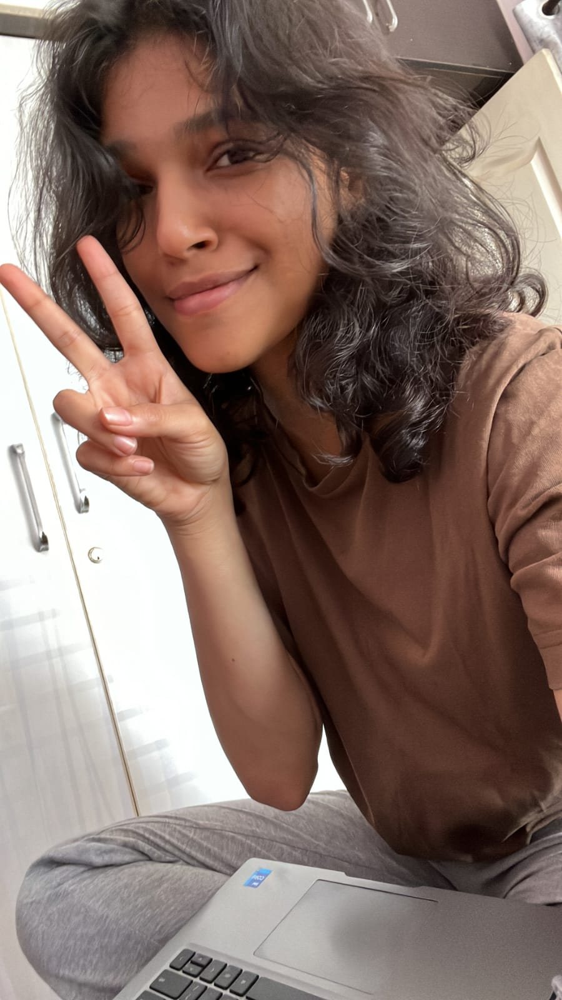

# Who am I?

Trust me I asked this plenty times? Who am I? Welcome to my personal corner of the internet! I decided I want to have my own space to write things that don't necessarily add value to anyone but me. 

## What I'm working on
- Building castles in the air
- Understanding my grumpy ass
- Becoming more humane
- Reading the best books
- Getting abs
- Having soulful conversations
- Learning new things
- Becoming more fluent in languages
- Graceful voice and posture
- Living life one day at a time
- Becoming more capable
- Appreciating Art & Sass

## What's the whole point?
All my life, I wondered why I don't have a purpose or a drive, wondering what my calling really is? As if it's very distant and unknown. Always dabbling with multiple avocations. Finally, thanks to my good friend, I have taken this up to put it all together in one place, and probably gift it to my future self. 

## Probability(the exisitence of our Future Selves)?
"Memento Mori" - Remember that you will die. I'm not completely sure, how long we will live from today. 

This endeavour is dedicated to my love & my life. 

---

[[index|Back to Home]]
