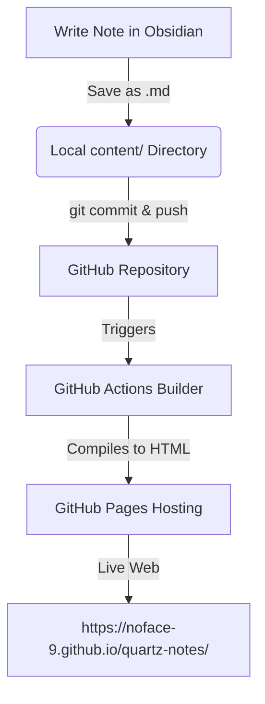
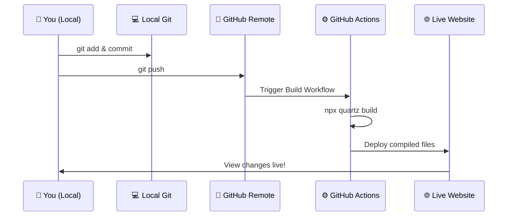

# Owner's Manual: Managing Your Digital Garden

Welcome to your Digital Garden manual! This guide provides everything you need to manage, update, write, link, and publish notes to your website autonomously.

---

## 🗺️ Architectural Overview

Your website is a **Digital Garden** compiled by **Quartz v5** from Markdown files and hosted on **GitHub Pages**. 



---

## 📂 Key Files & Directories

Here is where the crucial files live in your project directory `/Users/nimilithagurram/.gemini/antigravity/scratch/quartz-notes`:

| Path | Purpose | When to open / modify |
| :--- | :--- | :--- |
| `content/` | **Your Notes Vault**. All markdown pages go here. | When adding, editing, or deleting notes. |
| `content/index.md` | **The Homepage**. The landing page of your site. | When modifying your main introduction or main menu. |
| `content/About.md` | **About Me Page**. | When updating your personal profile or bio. |
| `quartz.config.yaml` | **Site Configuration**. Title, theme colors, fonts, links. | When changing global titles, headers, or colors. |
| `quartz/styles/custom.scss` | **Styling Sheet**. Controls the design elements. | When modifying card borders, custom styles, scrollbars, etc. |

---

## ✍️ Writing & Editing Notes

All your notes are standard Markdown files stored inside the `content/` folder.

### 1. Creating a New Note
Create a file ending in `.md` inside `content/` (e.g. `content/My New Idea.md`).
Every note should start with a **Frontmatter** block at the very top:
```markdown
---
title: "My New Idea"
---
```
*Tip: Keep the filename and frontmatter title identical to avoid confusion.*

### 2. Linking Notes (Bi-directional WikiLinks)
Quartz compiles standard Obsidian brackets `[[ ]]` into web links:
- **Direct Link**: `[[About]]` creates a link named *About*.
- **Custom Link Text**: `[[About|Read My Bio]]` creates a link to the About page displaying the text *Read My Bio*.
- **Sub-folders (Optional)**: If you organize notes into subfolders (e.g., `content/books/Atomic Habits.md`), link to them using the shortest name path: `[[Atomic Habits]]`.

---

## 🚀 Publishing Changes (Git Pipeline)

When you make changes locally, you must sync them to GitHub to update the live website.



### The Terminal Commands: Step-by-Step

Open your macOS Terminal and run these commands sequentially inside `/Users/nimilithagurram/.gemini/antigravity/scratch/quartz-notes`:

#### Step 1: Pull Latest (Optional)
If you made edits directly on GitHub.com or from another machine, pull those changes first:
```bash
git pull origin main
```

#### Step 2: Track New Files
Stage all your newly created and modified notes:
```bash
git add .
```

#### Step 3: Record Your Changes
Commit the staged notes with a short descriptive message describing what you added:
```bash
git commit -m "Add note on book reading and adjust index"
```

#### Step 4: Publish
Push the commits to your GitHub repository:
```bash
git push origin main
```

---

## 💻 Local Preview (Before Publishing)

Before pushing your changes to GitHub, you can preview exactly how they will look on your computer:

1. Open your macOS Terminal inside `/Users/nimilithagurram/.gemini/antigravity/scratch/quartz-notes`.
2. Run the local preview server command:
   ```bash
   npx quartz build --serve
   ```
3. Open your browser and go to **`http://localhost:8080`**.
4. Any changes you make to your notes in Obsidian will compile instantly and refresh in your browser!
5. To stop the local server, press `Ctrl + C` in your terminal.

---

## 🔍 Monitoring and Verifying Deployments

Once you run `git push`, the site will automatically rebuild and deploy. 

### 1. Check Build Progress in Terminal
You can use the GitHub CLI (`gh`) directly in your terminal to see if the deployment succeeded:
```bash
gh run list
```
*Look for the top run: a green `completed success` means your site is updated!*

### 2. Check Build Progress on Web
- Go to your repository page: [github.com/noface-9/quartz-notes](https://github.com/noface-9/quartz-notes)
- Click the **Actions** tab.
- You will see a live logging feed of the build process.

### 3. View Your Live Garden
Your changes will be live within 1 minute of a successful build at:
👉 **[https://noface-9.github.io/quartz-notes/](https://noface-9.github.io/quartz-notes/)**

---

## 💡 Troubleshooting Checklist

* **Broken links?** Make sure your bracket names match your file names exactly (case-insensitive, but spelling matters).
* **Build fails with `Failed to resolve...`?** Double-check that you haven't linked to a note that you deleted or forgot to add.
* **Changes not showing up live (CDN Propagation Delay)?** Even after GitHub Actions displays a green checkmark, GitHub's global CDN (Content Delivery Network) nodes can take **1 to 3 minutes** to sync and push the update to your region.
* **Browser Caching (Crucial)?** Browsers cache GitHub Pages for up to **10 minutes** to speed up loads. If you visit the site and see the old version, force your browser to clear its cache and fetch the fresh page:
  * **Mac**: `Cmd` + `Shift` + `R` (in Chrome/Safari)
  * **Windows**: `Ctrl` + `F5`
* **404 Not Found?** Make sure you do not include a trailing slash `/` at the end of the URL (e.g., visit `/about` instead of `/about/`).
